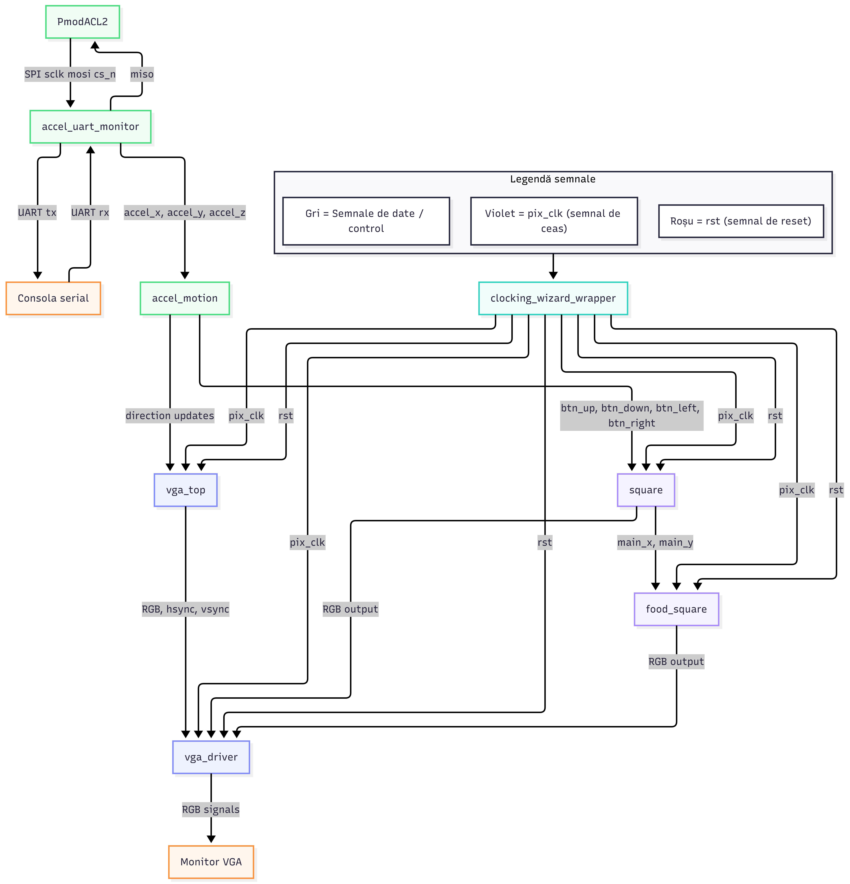

# Proiect FPGA - Controler VGA cu Patrat Mobil

**Placa Digilent Basys 3 (Xilinx Artix-7, XC7A35T-1CPG236C)**
Jurnalul etapelor parcurse in Vivado

---

## Istoric de revizii

| Versiune | Data | Descriere |
|---|---|---|
| 0.1 | 12 iulie 2026 | Varianta initiala a documentatiei: de la testul Blink LED pana la ecranul VGA cu fundal rosu si patratul verde mobil, controlat de switch-uri. |
| 0.2 | 14 iulie 2026 | Adaugarea patratelelor colorate aleatorii (galben, verde, albastru), care apar pe ecran si dispar la coliziunea cu patratul principal - primul pas catre un joc de tip Snake. |
| 0.3 | 14 iulie 2026 | Trecerea patratului principal dintr-o margine a ecranului in cealalta a fost facuta continua (wraparound smooth), nu instantanee; coliziunea cu patratelele aleatorii a fost corectata sa functioneze corect si in aceasta situatie. |
| 0.4 | 14 iulie 2026 | Controlul patratului principal a fost mutat de pe switch-uri pe butoanele fizice ale placii (btnU, btnD, btnL, btnR). |
| 0.5 | 20 iulie 2026 | Integrarea accelerometrului PmodACL2 (ADXL362): comunicare SPI cu senzorul, citirea celor trei axe si afisarea valorilor in consola serial (UART), fara a influenta inca miscarea. |
| 0.6 | 20 iulie 2026 | Folosirea valorilor de la accelerometru pentru a controla miscarea patratului: directia si viteza depind de inclinarea placii. |

## Obiective personale si profesionale

Pe plan personal, obiectivul acestui proiect este aprofundarea cunostintelor practice de proiectare digitala pe FPGA: scrierea de cod RTL in SystemVerilog, intelegerea timing-ului de semnal, verificarea prin testbench si integrarea de IP-uri predefinite (precum Clocking Wizard) - practic, trecerea de la cunostinte teoretice despre FPGA-uri la un flux de lucru complet, de la cod pana la hardware real, functional.

Pe plan profesional, dincolo de simpla observatie ca proiectul combina un controller (generarea semnalului VGA) cu un element de joc (patratul mobil si, acum, elementele aleatorii de tip Snake), valoarea principala sta in faptul ca documenteaza un **flux de dezvoltare hardware riguros si complet**: specificatie clara, implementare, verificare automata prin testbench inainte de a ajunge pe placa fizica, integrare de componente predefinite, depanare pe baza unor rezultate concrete de simulare, si extindere incrementala a unui sistem existent cu functionalitati noi, fara sa compromita ce functiona deja. Acest tip de proces - nu doar "a scrie cod care merge", ci a-l valida sistematic la fiecare pas - este exact ce se cere intr-un rol de inginerie digitala/embedded, si poate functiona ca piesa de portofoliu tehnic pentru aplicatii sau interviuri, aratand nu doar rezultatul final, ci si modul de lucru din spatele lui.

---

## 1. Introducere si obiectiv

Acest document descrie, in ordinea in care au fost parcursi, pasii urmati pentru dezvoltarea unui proiect FPGA pe placa Digilent Basys 3 (FPGA Xilinx Artix-7, part xc7a35tcpg236-1), in Xilinx Vivado.

Obiectivul final al proiectului este generarea unui semnal video VGA care afiseaza un fundal rosu, peste care se deplaseaza un patrat verde, controlat de patru switch-uri de pe placa:

| Switch | Directie |
|---|---|
| sw[0]  | Dreapta |
| sw[1]  | Sus |
| sw[14] | Jos |
| sw[15] | Stanga |

Codul sursa si constrangerile (.xdc) nu sunt incluse aici - documentul urmareste doar fluxul de lucru si deciziile luate la fiecare etapa.

## 2. Testul Blink LED

Proiectul a inceput cu un test simplu, minimal: un LED care clipeste, folosind ceasul de 100MHz de pe placa si un numarator. Scopul acestui prim pas nu a fost legat de VGA, ci de a valida intregul flux de lucru in Vivado, de la un capat la altul.

Dupa scrierea modulului si adaugarea constrangerilor de pini, s-a parcurs fluxul complet: sinteza, implementare, generarea bitstream-ului, si in final programarea efectiva a placii prin Hardware Manager. Placa a fost conectata prin USB, detectata automat (Auto Connect), iar bitstream-ul a fost incarcat pe FPGA cu succes.

Acest pas a confirmat doua lucruri esentiale inainte de a trece mai departe: ca fluxul complet Vivado functioneaza corect (proiect, sinteza, implementare, bitstream) si ca legatura fizica dintre calculator si placa este stabila si functionala.

## 3. Driver-ul VGA

Dupa validarea fluxului de baza, s-a trecut la partea centrala a proiectului: un modul care genereaza semnalul VGA propriu-zis - semnalele de sincronizare orizontala si verticala (hsync, vsync) si cele trei canale de culoare (rosu, verde, albastru), respectand timing-ul standard pentru rezolutia 640x480 la 60Hz.

Acest modul a fost dezvoltat si validat separat, inainte de a fi integrat intr-un proiect complet, folosind un testbench care verifica automat, ciclu cu ciclu, ca semnalele generate respecta exact timing-ul asteptat. Pe parcursul dezvoltarii au aparut cateva discrepante intre comportamentul modulului si ce astepta testbench-ul, cauzate de mici diferente de sincronizare interna; acestea au fost identificate si corectate pana cand toate verificarile au trecut cu succes.

Rezultatul acestui pas a fost un modul de generare VGA validat si functional, gata sa fie integrat intr-un proiect complet, capabil sa afiseze un ecran cu o culoare constanta.

## 4. Clocking Wizard

Semnalul VGA la rezolutia 640x480 @ 60Hz are nevoie de un ceas de pixel de 25MHz, insa placa Basys 3 ofera doar un ceas fix de 100MHz. Asadar era nevoie de un mecanism care sa deriveze un ceas de 25MHz din cel de 100MHz existent pe placa.

### 4.1. Ce este Clocking Wizard

Clocking Wizard este un IP (bloc functional predefinit) oferit de Vivado, care configureaza un bloc hardware dedicat existent fizic in FPGA, numit MMCM (Mixed-Mode Clock Manager) - o resursa specializata, complet separata de logica obisnuita (LUT-uri si bistabile), construita special pentru a genera si distribui semnale de ceas.

### 4.2. Ce face si de ce a fost ales in locul unui divizor de ceas simplu

Ceasul de 100MHz este preluat de MMCM, care il inmulteste si il imparte intern, dupa niste parametri calculati automat de Vivado in functie de frecventa dorita la iesire, obtinand exact ceasul de 25MHz cerut de proiect. O varianta alternativa, mai simpla, ar fi fost un divizor de ceas facut manual, dintr-un simplu numarator - insa aceasta solutie a fost evitata in favoarea Clocking Wizard-ului, din urmatoarele motive: semnalul de ceas obtinut printr-un MMCM este mult mai curat, este distribuit prin reteaua dedicata de ceas a FPGA-ului (nu prin logica obisnuita), iar IP-ul poate oferi si un semnal suplimentar, "locked", care confirma ca ceasul de iesire este stabil - un avantaj important pe care un divizor simplu nu il are.

### 4.3. Wrapper-ul generat

Clocking Wizard-ul a fost configurat printr-un Block Design (IP Integrator) in Vivado. Pentru a putea fi folosit ca un modul obisnuit, alaturi de restul codului scris de mana, Vivado a fost pus sa genereze un asa numit "HDL wrapper" - un modul generat automat, care expune la exterior porturile block design-ului (ceasul de intrare, ceasul de iesire si reset-ul), astfel incat acest wrapper sa poata fi instantiat direct in codul propriu, exact ca orice alt modul scris manual.

### 4.4. Decizia de a folosi reset activ pe HIGH

Butonul fizic de pe placa, folosit ca reset, este activ pe 1 (adica are valoarea 1 cand este apasat). Portul de reset asteptat de IP-ul Clocking Wizard este, de asemenea, activ pe 1. Pentru a evita sa fie nevoie de o inversare suplimentara a semnalului intre buton si acest IP, s-a decis ca reset-ul folosit in restul proiectului (inclusiv in driver-ul VGA) sa fie tot activ pe HIGH (activ pe 1), astfel incat butonul fizic sa poata fi conectat direct, fara nicio inversare, la toate blocurile din proiect care au nevoie de semnalul de reset.

## 5. Modulul de top (vga_top)

Cu driver-ul VGA validat si ceasul de pixel disponibil prin Clocking Wizard, urmatorul pas a fost crearea modulului de top al proiectului - cel care leaga toate componentele intre ele si le conecteaza la pinii fizici ai placii.

Acest modul instantiaza wrapper-ul Clocking Wizard-ului (pentru a obtine ceasul de 25.175MHz din cel de 100MHz), instantiaza driver-ul VGA (caruia ii transmite ceasul de pixel si reset-ul) si conecteaza iesirile acestuia direct la porturile fizice de sincronizare si culoare ale conectorului VGA de pe placa. Tot in acest modul a fost adaugat butonul de reset si, ulterior, switch-urile placii.

## 6. Validarea pe placa - ecran rosu

Dupa integrarea completa a driver-ului VGA si a Clocking Wizard-ului in modulul de top, si dupa completarea fisierului de constrangeri cu pinii corespunzatori conectorului VGA, proiectul a fost sintetizat, implementat si incarcat pe placa.

La conectarea unui monitor la portul VGA al placii, ecranul a afisat un fundal rosu, uniform, pe toata zona activa (640x480), cu marginile de blanking negre - confirmand ca timing-ul semnalului, conexiunile fizice si generarea ceasului de pixel functioneaza corect impreuna, pe hardware real, nu doar in simulare.

Acest rezultat a marcat finalul etapei de baza a proiectului: un ecran VGA stabil, cu o culoare de fundal constanta.

## 7. Patratul verde mobil

Ultima etapa a proiectului a adaugat elementul interactiv: un patrat verde, desenat peste fundalul rosu, care se poate deplasa pe ecran folosind patru switch-uri de pe placa - sw[0] pentru dreapta, sw[1] pentru sus, sw[14] pentru jos si sw[15] pentru stanga.

Modulul care deseneaza si controleaza patratul a fost proiectat separat de driver-ul VGA existent, mentinandu-si propriile numaratoare de pozitie pe pixel si linie, dar sincronizate perfect cu cele ale driver-ului, deoarece ambele module folosesc acelasi ceas de pixel si acelasi semnal de reset. Pozitia patratului se actualizeaza o data pe cadru, este limitata astfel incat patratul sa nu poata iesi de pe ecran, iar in modulul de top culoarea finala a fiecarui pixel este aleasa intre verde (daca pixelul se afla in interiorul patratului) si fundalul rosu generat de driver.

Cu aceasta ultima piesa integrata, proiectul a atins forma sa completa: un ecran VGA cu fundal rosu, peste care se deplaseaza un patrat verde, controlat in timp real de switch-urile placii.

## 8. Patratele colorate aleatorii (primul pas catre Snake)

*(Adaugat in versiunea 0.2)*

Pornind de la patratul verde mobil deja functional, a fost adaugat un al doilea element grafic: un patratel mai mic, care apare pe ecran intr-o pozitie aleatoare, intr-una din trei culori posibile - galben, verde sau albastru.

Generarea pozitiei si a culorii foloseste un LFSR (Linear Feedback Shift Register), tehnica standard in proiectarea digitala pentru a obtine valori pseudo-aleatoare in hardware, in absenta unui generator de numere aleatoare "adevarat". Modulul detecteaza suprapunerea dintre patratul principal si patratelul colorat; in momentul in care are loc atingerea, patratelul dispare si reapare imediat intr-o pozitie noua, cu o culoare noua, ambele alese aleator.

Comportamentul a fost validat printr-un testbench dedicat, care a confirmat ca: pozitia patratelului ramane mereu in limitele ecranului, coliziunea este detectata corect, iar reaparitia se intampla o singura data la fiecare atingere - nu repetat, cat timp cele doua patrate raman suprapuse.

Aceasta functionalitate constituie fundatia pentru un joc de tip Snake, care ramane obiectivul urmator al proiectului.

## 9. Trecere continua intre marginile ecranului (wraparound smooth)

*(Adaugat in versiunea 0.3)*

O prima varianta a miscarii la margine a fost una simpla: cand patratul principal ajungea la un capat al ecranului, sarea instantaneu pe partea opusa - un teleport brusc, vizibil ca o saritura, nu ca o trecere naturala.

Aceasta a fost inlocuita cu o trecere continua, de tip wraparound, similara cu efectul clasic din jocuri precum Pac-Man sau Snake: cand patratul depaseste o margine, o parte din el ramane vizibila pe acea margine, iar restul apare simultan pe marginea opusa, in aceeasi fereastra de timp - nu exista niciun moment in care patratul dispare complet, ca sa reapara in alta parte.

Din punct de vedere tehnic, aceasta a insemnat doua schimbari:

- **Miscarea** patratului nu mai este limitata strict intre 0 si marginea ecranului - pozitia avanseaza continuu, circular, pe toata latimea si inaltimea zonei active.
- **Desenarea** patratului a trebuit sa fie adaptata sa recunoasca situatia in care acesta este "taiat" de o margine, si sa deseneze ambele bucati corespunzatoare (cea de langa marginea de iesire si cea de langa marginea opusa) in acelasi cadru.

Aceasta modificare a scos la iveala o problema secundara: detectia coliziunii dintre patratul principal si patratelele aleatorii, construita initial pe o simpla comparatie de dreptunghiuri, nu mai functiona corect atunci cand patratul principal era taiat de o margine - coliziunile cu bucata "rupta", aparuta pe partea opusa a ecranului, nu erau detectate. Detectia de coliziune a fost si ea corectata, pentru a tine cont de aceasta situatie.

Comportamentul a fost validat prin simulare, pe scenarii care includ: randarea corecta a patratului in timpul trecerii peste fiecare dintre cele patru margini (inclusiv situatia in care trecerea orizontala si cea verticala se intampla simultan, in apropierea unui colt al ecranului), pasi de miscare uniformi in timpul trecerii, si detectia corecta a coliziunii atunci cand patratul principal este taiat de o margine, iar patratelul aleator se afla exact in zona aparuta pe partea opusa.

## 10. Controlul mutat pe butoane

*(Adaugat in versiunea 0.4)*

Controlul patratului principal a fost mutat de pe cele patru switch-uri folosite initial (sw[0], sw[1], sw[14], sw[15]) pe butoanele fizice ale placii - btnU, btnD, btnL si btnR - aflate alaturi de btnC, deja folosit ca buton de reset.

Modulul care controleaza miscarea patratului nu a fost modificat deloc; el primeste in continuare patru semnale logice de directie, indiferent de sursa lor fizica. Singura schimbare a fost la nivelul modulului de top, unde cele patru semnale au fost conectate la butoane in loc de switch-uri.

A fost luata in calcul si necesitatea unui circuit de debounce, intrucat butoanele fizice pot avea contact instabil (bounce) la apasare, spre deosebire de switch-uri. In acest caz, un astfel de circuit nu a fost necesar: miscarea este citita ca nivel continuu (cat timp butonul e apasat, patratul se misca), verificata doar de cateva ori pe secunda - un interval mult mai lung decat durata tipica a unui bounce, care se stabilizeaza natural intre doua verificari consecutive.

## 11. Integrarea accelerometrului PmodACL2

*(Adaugat in versiunea 0.5)*

A fost adaugat un accelerometru PmodACL2 (avand la baza cipul Analog Devices ADXL362), un senzor de acceleratie pe trei axe, de consum foarte redus. Scopul final este ca inclinarea placii sa controleze miscarea patratului, insa primul pas a fost doar citirea si afisarea valorilor brute, fara sa influenteze inca jocul.

### 11.1. Comunicarea cu senzorul (SPI)

Accelerometrul comunica prin protocolul SPI. A fost proiectat un modul care se ocupa de tot dialogul cu senzorul, in trei faze:

- **Pornire**: dupa alimentare, senzorul are nevoie de o scurta perioada de stabilizare, dupa care primeste comanda de resetare software.
- **Configurare**: senzorul porneste implicit intr-un mod de asteptare (standby), in care nu masoara nimic. Este necesara o comanda de configurare care il trece in modul de masurare activa.
- **Citire periodica**: de cateva ori pe secunda, modulul citeste, printr-o singura tranzactie, valorile tuturor celor trei axe (X, Y, Z). Citirea lor impreuna garanteaza ca provin din exact acelasi moment de esantionare.

Fiecare axa este returnata ca o valoare pe 16 biti, cu semn (numerele negative corespund inclinarii in sensul opus).

### 11.2. Afisarea valorilor in consola (UART)

Pentru a putea vedea efectiv ce "simte" senzorul, valorile celor trei axe sunt trimise catre calculator prin portul serial (UART), unde pot fi citite intr-un terminal (de exemplu PuTTY). Deoarece transmisia seriala foloseste caractere text, valorile numerice (in format binar) trebuie mai intai transformate in cifre zecimale lizibile - o conversie realizata printr-un algoritm dedicat (cunoscut ca "double dabble"), potrivit pentru implementarea in hardware.

Rezultatul este un flux continuu de valori afisate in consola, actualizate de cateva ori pe secunda, care se modifica vizibil pe masura ce placa este inclinata pe diferite axe. Acest pas a confirmat ca intreg lantul - senzor, comunicare SPI, conversie si transmisie seriala - functioneaza corect, inainte de a folosi datele pentru altceva.

## 12. Miscarea patratului in functie de inclinare

*(Adaugat in versiunea 0.6)*

Odata ce valorile de la accelerometru erau disponibile si validate, ele au fost folosite pentru a controla miscarea patratului principal, inlocuind (sau completand) comanda de la butoane.

Logica este simpla: pentru fiecare axa, valoarea de acceleratie este comparata cu niste praguri. Se disting trei zone:

- o **zona moarta** in jurul valorii de repaus, in care patratul nu se misca deloc (necesara, altfel patratul ar tremura constant din cauza micilor variatii si a zgomotului senzorului);
- o **zona de inclinare moderata**, in care patratul se misca lent;
- o **zona de inclinare accentuata**, in care patratul se misca rapid.

Semnul valorii (pozitiv sau negativ) determina directia de miscare, iar marimea inclinarii determina viteza. Astfel, cu cat placa este inclinata mai mult intr-o directie, cu atat patratul se deplaseaza mai repede in acea directie.

Controlul prin accelerometru si cel prin butoane coexista: oricare dintre cele doua surse poate misca patratul, ceea ce lasa loc pentru comparatie si pentru o eventuala revenire la butoane in orice moment.

## Schema bloc a proiectului

Schema de mai sus arata toate modulele proiectului si legaturile dintre ele, grupate pe cele doua domenii de ceas:

- **Lantul accelerometrului** (verde): `PmodACL2 -> accel_uart_monitor -> accel_motion`, cu ramificatia catre consola serial (UART) si valorile `accel_x, accel_y, accel_z` trimise mai departe catre logica de miscare.
- **Lantul video** (mov/albastru): `clocking_wizard_wrapper` furnizeaza `pix_clk` si `rst` catre `vga_top`, `square` si `food_square`; `square` primeste directiile de miscare (de la butoane si/sau de la `accel_motion`) si expune pozitia sa (`main_x, main_y`) catre `food_square`, pentru detectia de coliziune; toate cele trei module isi trimit iesirile de culoare RGB catre `vga_driver`, care genereaza semnalul final catre monitorul VGA.
- **Legenda de culori** din diagrama diferentiaza semnalele de date/control (gri) de cele doua semnale globale care circula prin intreg proiectul: ceasul de pixel `pix_clk` (violet) si reset-ul `rst` (rosu).

---

